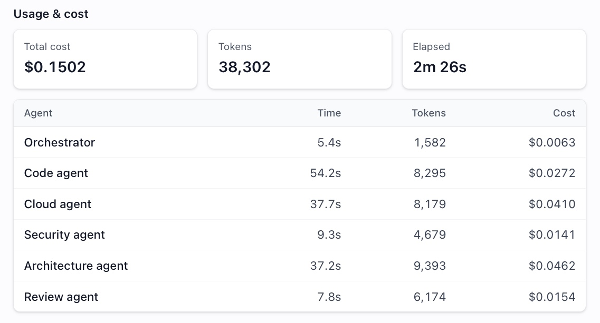
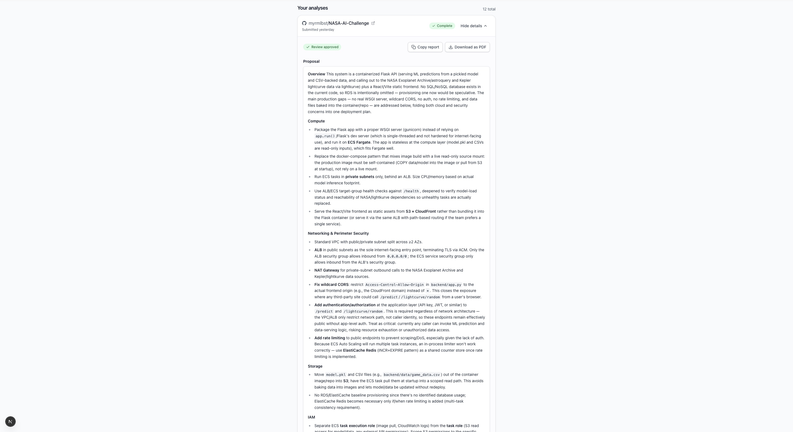
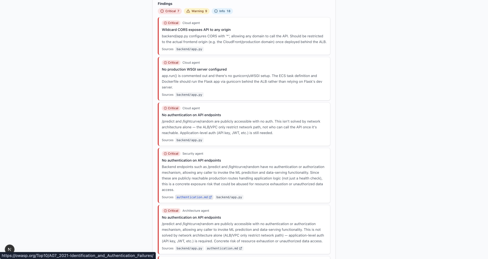
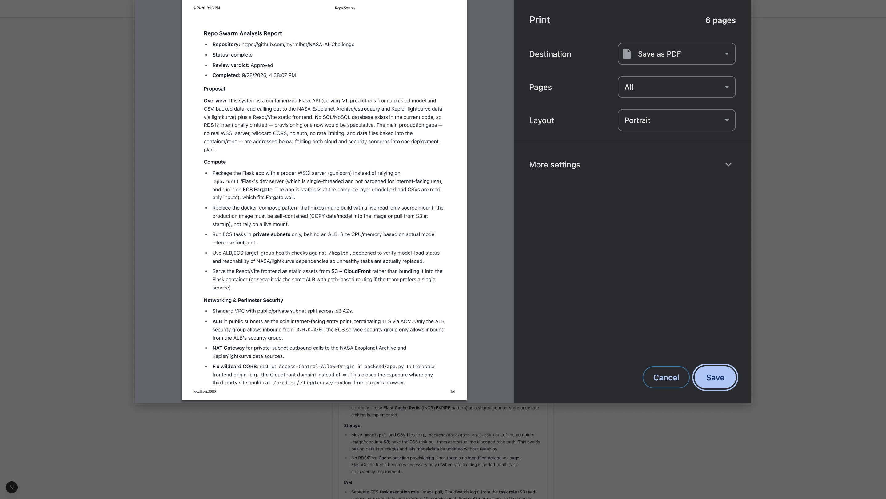

# My 10x Solution: Repo Swarm

**Myriam B** · FlyRank Internship, Backend Track Capstone

## 1. The Problem

Shipping an application to production securely requires knowledge that spans three different domains at once: the codebase itself, cloud infrastructure, and security best practices. Most solo developers and small teams don't have a dedicated DevOps or security engineer to cover all three before launch. Manually auditing a repo for deployment-readiness and security gaps is slow, inconsistent, and easy to get wrong under deadline pressure. Generic AI code-review tools give shallow advice because they run one prompt over an entire repo instead of retrieving the specific context each concern actually needs.

**Who Has This Problem:** Solo developers and small engineering teams without a dedicated DevOps or security engineer, who are about to take a side project or MVP to production and need an AWS deployment and security review before launch.

**The 10x Claim:** What normally takes a senior engineer hours of manual work (reading the codebase, researching the right AWS services, checking for OWASP-style security issues, and writing up a coherent proposal) comes back instead as a reviewed, source-cited architecture proposal in a minute or less. A much larger codebase with many critical issues may take up to 2 minutes, as documented below:


_[Image 1: Total Time Elapsed + Agents' Cost and Token Breakdown]_

**Non-Goal:** Repo Swarm does not execute any changes it recommends (no auto-PRs, no infrastructure provisioning). It produces a reviewed proposal for a human to act on; it does not act on the repo or cloud account itself.

## 2. How It Works

Repo Swarm is a multi-agent system: Point it at a GitHub repo, and instead of one giant prompt trying to reason about code, AWS, and security all at once, an orchestrator fans the work out to specialist agents that each retrieve only the context their concern needs.

A **Code Agent** indexes the repo (chunk → embed → store in a namespaced vector DB) and extracts structured facts: framework, database, auth mechanism, external services, obvious gaps. **Cloud** and **Security** agents then run in parallel off that output, each retrieving from their own knowledge base (AWS docs; OWASP + internal security policy) instead of the raw repo. An **Architecture Agent** combines their findings into one coherent proposal, and a **Review Agent** critiques that proposal for unsupported claims or invented requirements before it's returned. 


_[Image 2: Specialized Subagents' Findings, Partitioned by Type]_



_[Image 3: RAG Implementation that Links to Official Documentation]_

Two guardrails sit on the agents that touch untrusted repo content: prompt-injection resistance (so text embedded in a scanned repo can't hijack the agent), and redaction of any real secrets the Code Agent discovers, so they're never echoed back in a response.

Findings appear in the web app under the submitted repository's specific tab, and information can either be copied as an ```.md``` file or downloaded as a PDF file.


_[Image 4: PDF Reporting Feature]_

### Concepts Implemented

All seven core concepts from the program are implemented:

| Concept | Where it lives |
|---|---|
| API endpoints | `api/src/routes/analyses.ts`, `api/src/routes/apiKeys.ts`: `POST /v1/analyses`, `GET /v1/analyses/{id}`, `GET /v1/analyses/{id}/findings` |
| Database | Postgres via Supabase: `supabase/migrations/` (`api_keys`, `analyses`, `findings`, `analysis_runs`) |
| Authentication | Supabase Auth (session JWT) + API keys for programmatic access: `api/src/lib/auth.ts`, `api/src/lib/apiKeys.ts` |
| Reporting (PDF) | Each completed analysis can be copied as one Markdown report or downloaded as a PDF via the browser's own print dialog: `web/src/components/AnalysesList.tsx`, `web/src/lib/report.ts` |
| Background jobs | A queue worker (`agents/src/worker.ts`) picks up and processes analyses off the request path (`POST /v1/analyses` just enqueues) |
| Caching | Redis-backed cache of structured per-repo facts (not raw Q&A strings): `agents/src/lib/codeFactsCache.ts` |
| LLM integration | Orchestrator + five specialist agents (Code, Cloud, Security, Architecture, Review) built on the Anthropic API |

Beyond the core seven, some additional concepts from the swap table are also implemented, going further still:

| Concept | Why it's here | Where it lives |
|---|---|---|
| RAG with citations | The core of the product's value: proposals are grounded in retrieved AWS/security docs and the repo's own code, not model memory alone | `agents/src/lib/rag/`: Voyage embeddings + pgvector, namespaced per collection |
| Agent with guardrails | Directly required by working over untrusted, arbitrary GitHub repos: an agent that reads code it doesn't control needs limits | prompt-injection filtering + secret redaction on the Code and Security agents |
| Rate Limiting / Quotas | Real per-user/API-key limits on analyses and tokens per period, enforced with counters, not just middleware | limits on tokens per certain periods of time |

## 3. How to Run It

Prerequisites: Node 20+, a free [Supabase](https://supabase.com) project, a free [Upstash](https://upstash.com) Redis database, and an Anthropic + Voyage API key.

```bash
scripts/setup.sh   # installs deps in api/, web/, agents/, creates .env files from templates
# fill in the created .env files (Supabase, Upstash, Anthropic, Voyage keys)
scripts/dev.sh      # starts the API, the web app, and the agents worker together
```

The README.md also contains alternate instructions to run the program step by step (without scripts).

Once all is set up, open the web app, sign up, and submit a GitHub repo URL; the worker will process it and the dashboard shows the resulting proposal once it completes (usually 1–2 minutes). Full step-by-step instructions (including running the SQL migrations) are in the repo's `README.md`.
