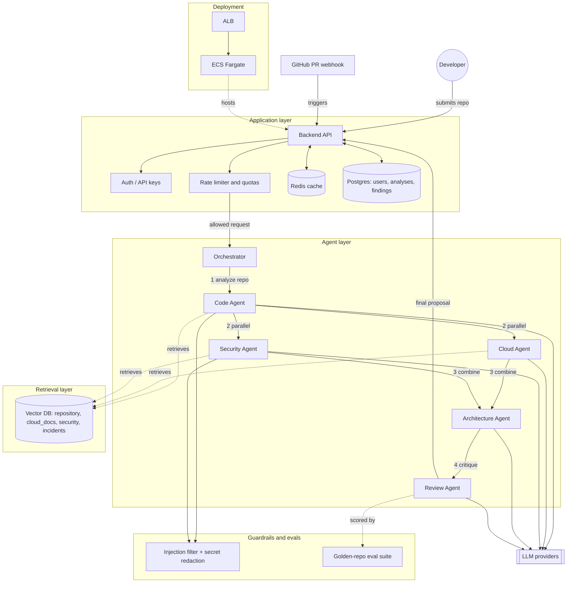

# Repo Swarm

A multi-agent AI system: Point it at a GitHub repo and have it orchestrate multiple parallel subagents to index, architect, secure, deploy, and review your GitHub code repositories.

## The Problem

Shipping an application to production securely requires cross-cutting knowledge (the codebase, AWS infrastructure, and security best practices) that most solo developers and small teams don't have in-house all at once. Manually auditing a repo for deployment-readiness and security gaps is slow, inconsistent, and easy to get wrong under deadline pressure. Generic AI code-review tools give shallow advice because they run one prompt over the whole repo instead of retrieving the specific context each concern actually needs.

## Who Has This Problem

**Solo developers** and **small engineering teams without a dedicated DevOps or security engineer**, who are about to take a side project or MVP to production and need an AWS deployment and security review before launch.

## The 10x Claim

What normally takes a senior engineer hours of manual review (reading the codebase, researching the right AWS services, checking for OWASP-style security issues, and writing up a coherent proposal) comes back as a reviewed, source-cited architecture proposal in under a minute.

RAG and multi-agent systems solve different problems, and they become powerful together:

- **RAG** gives agents knowledge they don't inherently have, by retrieving relevant documents, code, logs, policies, etc.
- **Multi-agent** divides the reasoning/workflow into specialized responsibilities.

So instead of one giant agent trying to understand your codebase, AWS, security, architecture, and deployment all at once, you give different agents narrower jobs and let each retrieve the information it needs.

## Concept Coverage

The capstone requires all of the following concepts. Most are ordinary application-layer engineering around the agent system; a few are specific to how the agents themselves reason.

**Application Layer**

| Concept                | How it shows up                                                                                                                                                                                                                                                                        |
| ---------------------- | -------------------------------------------------------------------------------------------------------------------------------------------------------------------------------------------------------------------------------------------------------------------------------------- |
| API endpoints          | [`api/src/routes/analyses.ts`](api/src/routes/analyses.ts), [`api/src/routes/apiKeys.ts`](api/src/routes/apiKeys.ts) — `POST /analyses`, `GET /analyses/{id}`, `GET /analyses/{id}/findings`, `GET /analyses/{id}/trace` all implemented; the GitHub webhook receiver is still planned |
| Database               | Postgres via Supabase — [`supabase/migrations/0001_init.sql`](supabase/migrations/0001_init.sql) (`api_keys`, `analyses` so far; `findings`/`analysis_runs` land with the agent layer)                                                                                                 |
| Authentication         | Supabase Auth (session JWT) + API keys for programmatic access — [`api/src/lib/auth.ts`](api/src/lib/auth.ts), [`api/src/lib/apiKeys.ts`](api/src/lib/apiKeys.ts)                                                                                                                      |
| Caching                | Redis in front of the API/DB — cache structured per-repo facts, not raw Q&A strings (low hit rate on natural-language queries)                                                                                                                                                         |
| Rate limiting / quotas | Real per-user/API-key limits on analyses and tokens per period, enforced with counters, not just middleware                                                                                                                                                                            |
| Deployment             | Containerized, deployed on the same ECS/Fargate/RDS pattern the Cloud Agent recommends to others                                                                                                                                                                                       |

**Agent Layer**

| Concept                        | How it shows up                                                                                                                                                        |
| ------------------------------ | ---------------------------------------------------------------------------------------------------------------------------------------------------------------------- |
| LLM integration                | Orchestrator + specialist agents (Code, Cloud, Security, Architecture, Review)                                                                                         |
| Retrieval-augmented generation | Voyage embeddings + pgvector on Supabase, namespaced per collection — [`agents/src/lib/rag/`](agents/src/lib/rag/), [DESIGNDOC.md § 6](DESIGNDOC.md#6-retrieval-layer) |
| Agent with guardrails          | Prompt-injection resistance against untrusted repo content; redaction of real secrets discovered in code instead of echoing them back                                  |
| Model evaluations              | Small labeled golden-repo dataset with known issues, scored for precision/recall — not just cost/latency telemetry                                                     |
| Parallel agents                | Code Agent runs first; Cloud and Security agents then run in parallel off its output, followed by Architecture Agent and Review Agent                                  |

Build order: get the vertical slice working end to end first (API → orchestrator → Code Agent → RAG → one downstream agent), then layer in auth/quotas/deployment, then guardrails/evals.

## Getting Started

Prerequisites: Node 20+, a [Supabase](https://supabase.com) project.

Prerequisites also: an [Upstash](https://upstash.com) Redis database (free tier) — backs rate limiting, quotas, and `code_agent`'s caching.

1. In the Supabase dashboard: run `supabase/migrations/0001_init.sql` through `0004_analysis_results.sql`, in order, in the SQL editor (`0002` enables `pgvector` for RAG, `0003` adds quota tracking, `0004` adds `analysis_runs`/`findings` and the `analyses.proposal`/`review_approved` columns).
2. `cd api && cp .env.example .env` and fill in `SUPABASE_URL`, `SUPABASE_ANON_KEY`, `SUPABASE_SERVICE_ROLE_KEY` (Project Settings → API) and `UPSTASH_REDIS_REST_URL`/`UPSTASH_REDIS_REST_TOKEN` (from your Upstash database).
3. `cd api && npm install && npm run dev` — starts the API (`PORT` in `.env`, default `3000`).
4. `cd web && cp .env.local.example .env.local` and fill in `NEXT_PUBLIC_SUPABASE_URL`, `NEXT_PUBLIC_SUPABASE_ANON_KEY` (same project, same anon key) and `NEXT_PUBLIC_API_BASE_URL` (the API's URL from step 3).
5. `cd web && npm install && npm run dev` — starts the frontend at `http://localhost:3000` (or wherever Next picks if that port's busy).
6. `cd agents && cp .env.example .env` and fill in `ANTHROPIC_API_KEY`, `VOYAGE_API_KEY` ([voyageai.com](https://www.voyageai.com)), `SUPABASE_URL`/`SUPABASE_SERVICE_ROLE_KEY` (same project as step 2), and `UPSTASH_REDIS_REST_URL`/`UPSTASH_REDIS_REST_TOKEN` (same Upstash database as step 2). Then `npm install`.
7. `npm run seed-knowledge` (from `agents/`) — one-time: embeds and indexes the `cloud_docs`/`security` corpus. Re-run any time you edit `agents/knowledge/`.
8. `npm run worker` (from `agents/`) — starts the queue consumer that actually processes analyses submitted through the API (step 3's `POST /v1/analyses` just queues them; this is what picks them up). Needs to be running for the web app or a direct `curl` to `api/` to produce a real result — see [System Architecture](#system-architecture) below.

Or use the [`scripts/`](scripts/) wrappers instead of steps 2–6 and 8:

- `scripts/setup.sh` — installs dependencies in `api/`, `web/`, and `agents/`, and creates any missing `.env` files from their `.example` counterparts (never overwrites an existing one).
- `scripts/dev.sh` — starts `api/`, `web/`, **and** the `agents/` worker together (Ctrl-C stops all three) — this is the one that gives you the actual working product.
- `scripts/agents.sh <repo_url> "<question>"` — runs the orchestrator standalone via `agents/`'s `npm run dev`, independent of the API/queue/worker entirely — useful for testing agent changes directly.

Open the frontend, sign up with email/password (or GitHub, once configured — see below), and submit a repo URL — with the worker running, it'll actually process and the dashboard will show a real result once it completes (usually 1-2 minutes). To drive the API directly instead:

```bash
curl -X POST http://localhost:3000/v1/analyses \
  -H "Authorization: Bearer $ACCESS_TOKEN" \
  -H "Content-Type: application/json" \
  -d '{"repo_url": "https://github.com/octocat/Hello-World"}'
```

where `$ACCESS_TOKEN` is the `access_token` from a Supabase `signInWithPassword`/`signUp` call.

**To enable "Continue with GitHub"**: create a GitHub OAuth App (github.com/settings/developers) with callback URL `https://<project-ref>.supabase.co/auth/v1/callback`; paste its Client ID/Secret into Supabase's Authentication → Providers → GitHub; then add your frontend's `/auth/callback` URL (e.g. `http://localhost:3000/auth/callback`) to Authentication → URL Configuration → Redirect URLs.

## System Architecture



- **Solid arrows** are the request/response path. **Dashed arrows** are retrieval, scoring, or hosting relationships.
- Code Agent runs first; Cloud and Security agents fan out in parallel off its output, then Architecture and Review run sequentially.
- Guardrails sit on the agents that touch untrusted repo content (Code, Security) — filtering prompt injection in and redacting real secrets out.

## Example Flow

Imagine a developer connects a repository and asks:

> "How should I deploy this application securely on AWS, and what changes should I make before production?"

The system might work like this:

```text
Developer
   │
   ▼
Orchestrator
   │
   ├───────────────┬────────────────┬────────────────
   ▼               ▼                ▼
Code Agent     Cloud Agent      Security Agent
   │               │                │
   ▼               ▼                ▼
Code RAG        AWS RAG         Security RAG
   │               │                │
   └───────────────┴────────────────┘
                   │
                   ▼
            Architecture Agent
                   │
                   ▼
              Review Agent
                   │
                   ▼
             Final Proposal
```

## 1. The Orchestrator Agent

The orchestrator is basically the manager.

It doesn't necessarily solve the problem itself. Instead, it looks at the user's request and decides:

> "This question requires code analysis, cloud architecture, and security analysis."

It could produce a task plan internally like:

```json
{
  "tasks": [
    {
      "agent": "code_agent",
      "task": "Analyze application architecture and dependencies"
    },
    {
      "agent": "cloud_agent",
      "task": "Design AWS deployment architecture"
    },
    {
      "agent": "security_agent",
      "task": "Identify production security risks"
    }
  ]
}
```

This is where your agent orchestration happens. You could implement this using your own Python/TypeScript orchestration logic, or frameworks such as LangGraph.

## 2. The Code Agent

The Code Agent specializes in understanding the repository.

Suppose the project has:

```text
/app
    main.py
    auth.py
    database.py
    ai.py

/docker
    Dockerfile

terraform/
    main.tf

README.md
```

Instead of dumping the entire repository into the model context, you index the repository:

```text
Source code
    ↓
Chunking
    ↓
Embeddings
    ↓
Vector database
```

Then the Code Agent can perform searches like:

- "database connection configuration"
- "authentication implementation"
- "where API keys are loaded"
- "external AI API calls"

The RAG system might return:

- `database.py`
- `auth.py`
- `config.py`

The agent then discovers things like:

- FastAPI application
- PostgreSQL database
- JWT authentication
- OpenAI API usage
- Dockerfile present
- No health endpoint
- No rate limiting

That becomes structured information for the other agents. For example:

```json
{
  "framework": "FastAPI",
  "database": "PostgreSQL",
  "containerized": true,
  "authentication": "JWT",
  "external_services": ["OpenAI"],
  "issues": ["No rate limiting", "No health check endpoint"]
}
```

This is a very natural use of RAG over source code.

## 3. The Cloud Agent

The Cloud Agent receives information from the Code Agent:

- FastAPI
- Docker
- PostgreSQL
- OpenAI API

Its task is:

> "Design an AWS architecture appropriate for this application."

Its RAG knowledge base might contain AWS documentation about:

- ECS
- Fargate
- RDS
- ALB
- CloudWatch
- Secrets Manager
- IAM
- VPC
- Auto Scaling

It could retrieve documentation related to:

- running Docker workloads
- connecting ECS to RDS
- storing application secrets
- load balancing HTTP APIs

Then it proposes something like:

```text
Internet
   │
   ▼
Application Load Balancer
   │
   ▼
ECS Fargate
   │
   ├──── RDS PostgreSQL
   │
   ├──── Redis
   │
   └──── OpenAI API
```

And infrastructure services:

- CloudWatch → logging
- Secrets Manager → API keys
- IAM → service permissions
- VPC → network isolation

Notice something important here: the Cloud Agent doesn't need your entire repository. It only needs:

1. The relevant architectural information from the Code Agent.
2. Relevant AWS documentation from RAG.

That separation reduces context clutter.

## 4. The Security Agent

Now another agent specifically looks for security problems.

Its RAG system could contain:

- OWASP recommendations
- AWS security documentation
- internal engineering security policies
- previous security incidents

It might also ask the Code RAG system questions like:

- "Where are secrets stored?"
- "How is authentication implemented?"
- "Are user inputs validated?"
- "Is there rate limiting?"

The agent might discover:

- `OPENAI_API_KEY` stored in `.env`
- JWT tokens used
- no rate limiting
- database publicly accessible
- broad IAM permissions

Then it could recommend:

- Secrets Manager for credentials
- private RDS subnet
- least-privilege IAM
- API rate limiting
- input validation
- TLS termination at ALB

This is where multiple agents become more convincing than one big prompt. You're effectively saying:

> "You're the security specialist. Ignore everything except security."

## 5. Architecture Agent

Then you have an agent that combines the specialists' findings. It receives outputs such as:

```text
CODE AGENT
  FastAPI
  PostgreSQL
  Docker
  OpenAI API

CLOUD AGENT
  ECS Fargate
  RDS PostgreSQL
  ALB
  CloudWatch

SECURITY AGENT
  Secrets Manager
  private networking
  rate limiting
  least privilege IAM
```

It combines them into one coherent architecture:

```text
                         Internet
                            │
                            ▼
                   Application Load Balancer
                            │
                            ▼
                     ECS Fargate Cluster
                     /       |        \
                    /        |         \
                   ▼         ▼          ▼
             RDS PostgreSQL Redis    OpenAI API
                   │
                   ▼
              Private Subnet
```

Supporting services:

- CloudWatch
- Secrets Manager
- IAM
- Auto Scaling

It might even generate Terraform recommendations.

## 6. Review Agent

This is one of my favorite agents to include. Its job isn't to produce another solution — its job is to attack the existing solution.

For example:

> "Find contradictions, hallucinations, unsupported claims, and architecture problems."

Suppose the Cloud Agent recommends Redis. The Review Agent asks:

> "Does this application actually require Redis?"

If nothing from the repository supports that requirement, it might flag:

> Redis appears unnecessary based on the current workload.

Or suppose the Architecture Agent recommends WebSockets. The reviewer might say:

> No real-time communication requirements were found in the repository.

This helps prevent agents from adding random technologies just because they're trendy.
