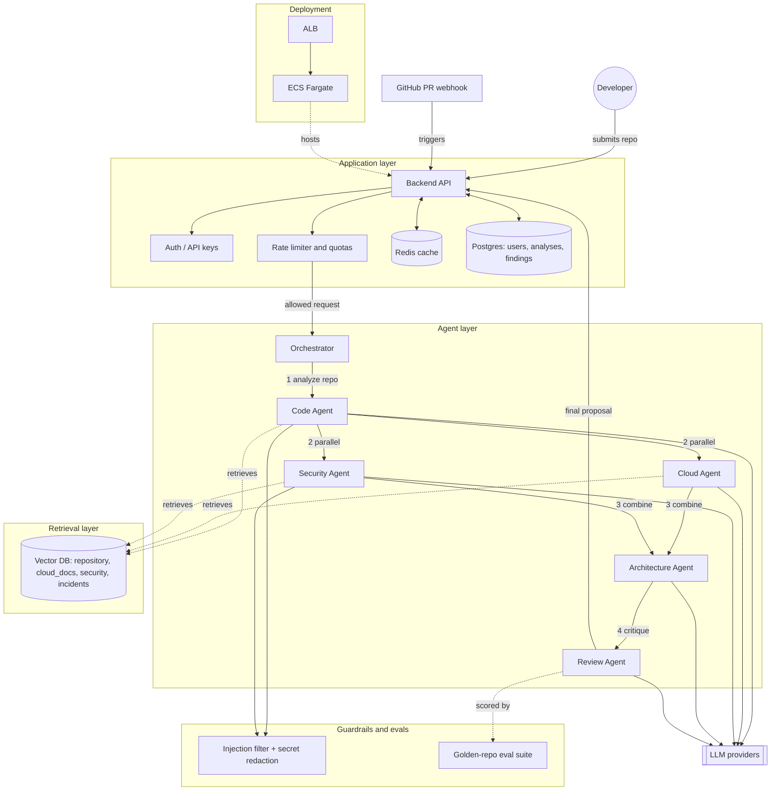

# Repo Swarm

An AI software architecture assistant: submit a repo, get back a reviewed, AWS-specific deployment and security architecture from a swarm of specialist agents.

RAG and multi-agent systems solve different problems, and they become powerful together:

- **RAG** gives agents knowledge they don't inherently have, by retrieving relevant documents, code, logs, policies, etc.
- **Multi-agent** divides the reasoning/workflow into specialized responsibilities.

So instead of one giant agent trying to understand your codebase, AWS, security, architecture, and deployment all at once, you give different agents narrower jobs and let each retrieve the information it needs.

## Concept Coverage

The capstone requires all of the following concepts. Most are ordinary application-layer engineering around the agent system; a few are specific to how the agents themselves reason.

**Application Layer**

| Concept                | How it shows up                                                                                                                                                                                                                                |
| ---------------------- | ---------------------------------------------------------------------------------------------------------------------------------------------------------------------------------------------------------------------------------------------- |
| API endpoints          | [`api/src/routes/analyses.ts`](api/src/routes/analyses.ts), [`api/src/routes/apiKeys.ts`](api/src/routes/apiKeys.ts) — `POST /analyses`, `GET /analyses/{id}`, `GET /analyses/{id}/findings` and the GitHub webhook receiver are still planned |
| Database               | Postgres via Supabase — [`supabase/migrations/0001_init.sql`](supabase/migrations/0001_init.sql) (`api_keys`, `analyses` so far; `findings`/`analysis_runs` land with the agent layer)                                                         |
| Authentication         | Supabase Auth (session JWT) + API keys for programmatic access — [`api/src/lib/auth.ts`](api/src/lib/auth.ts), [`api/src/lib/apiKeys.ts`](api/src/lib/apiKeys.ts)                                                                              |
| Caching                | Redis in front of the API/DB — cache structured per-repo facts, not raw Q&A strings (low hit rate on natural-language queries)                                                                                                                 |
| Rate limiting / quotas | Real per-user/API-key limits on analyses and tokens per period, enforced with counters, not just middleware                                                                                                                                    |
| Deployment             | Containerized, deployed on the same ECS/Fargate/RDS pattern the Cloud Agent recommends to others                                                                                                                                               |

**Agent layer**

| Concept                        | How it shows up                                                                                                                                  |
| ------------------------------ | ------------------------------------------------------------------------------------------------------------------------------------------------ |
| LLM integration                | Orchestrator + specialist agents (Code, Cloud, Security, Architecture, Review)                                                                   |
| Retrieval-augmented generation | Namespaced vector collections (`repository`, `cloud_docs`, `security`, `incidents`) with per-agent retrieval permissions                         |
| Agent with guardrails          | Prompt-injection resistance against untrusted repo content; redaction of real secrets discovered in code instead of echoing them back            |
| Model evaluations              | Small labeled golden-repo dataset with known issues, scored for precision/recall — not just cost/latency telemetry                               |
| Parallel agents                | Code Agent runs first; Cloud, Security, and Incident agents then run in parallel off its output, followed by Architecture Agent and Review Agent |

Build order: get the vertical slice working end to end first (API → orchestrator → Code Agent → RAG → one downstream agent), then layer in auth/quotas/deployment, then guardrails/evals.

## Current implementation status

**Done:** the application layer's API, database, and auth; and, in the agent layer, the orchestrator itself (real Claude-driven task planning + fixed dispatch order), with all five specialist agents currently stubbed out. Submitting a repo via the API still just queues a row — the orchestrator isn't wired into the API yet, but it runs standalone (see `agents/` below).

- `api/` — a standalone Fastify + TypeScript service. Endpoints:
  - `POST /v1/analyses` — submit a GitHub repo URL, returns `{ id, status: "queued" }`
  - `GET /v1/analyses` — list your own analyses
  - `GET /v1/analyses/:id` — fetch one (yours only)
  - `POST /v1/api-keys` / `GET /v1/api-keys` / `DELETE /v1/api-keys/:id` — programmatic API key management
  - `GET /v1/me` — resolves whoever the bearer token belongs to
- `supabase/migrations/` — the `api_keys` and `analyses` tables, with row-level security
- Full request/response reference: [docs/API.md](docs/API.md)
- Auth is Supabase Auth (email/password + GitHub OAuth). Sign-up/login happen client-side against Supabase directly (no proxy endpoints); the API verifies the resulting session JWT, or a `rsw_live_...` API key, on every protected route.
- `web/` — a Next.js frontend: a login screen (email/password + "Continue with GitHub"), and a dashboard to submit a repo URL and see your own analyses with their status. Talks to `api/` directly from the browser using the logged-in session token.
- `agents/` — a standalone TypeScript module for the agent layer, runnable without `api/`:
  - [`agents/src/orchestrator.ts`](agents/src/orchestrator.ts) — calls Claude (forced tool-use, so the plan is always valid JSON) to decide which specialist agents a request needs and what to ask each, then runs them in the fixed dependency order from [DESIGNDOC.md § 3](DESIGNDOC.md#3-architecture): `code_agent` alone → `{cloud_agent, security_agent}` in parallel → `architecture_agent` → `review_agent`.
  - [`agents/src/agents/`](agents/src/agents/) — one file per specialist agent (`code_agent`, `cloud_agent`, `security_agent`, `architecture_agent`, `review_agent`); all five are currently stubs that echo their task back rather than doing real analysis.
  - [`agents/src/runner.ts`](agents/src/runner.ts) — CLI entry point: `npm run dev -- <repo_url> "<question>"`.

**Not built yet:** real logic for any of the five specialist agents (RAG/vector DB retrieval, actual findings), caching, rate limiting/quotas, guardrails, evals, deployment, and wiring the orchestrator into `POST /v1/analyses`.

### Getting started

Prerequisites: Node 20+, a [Supabase](https://supabase.com) project.

1. In the Supabase dashboard: run `supabase/migrations/0001_init.sql` in the SQL editor.
2. `cd api && cp .env.example .env` and fill in `SUPABASE_URL`, `SUPABASE_ANON_KEY`, `SUPABASE_SERVICE_ROLE_KEY` from Project Settings → API.
3. `cd api && npm install && npm run dev` — starts the API (`PORT` in `.env`, default `3000`).
4. `cd web && cp .env.local.example .env.local` and fill in `NEXT_PUBLIC_SUPABASE_URL`, `NEXT_PUBLIC_SUPABASE_ANON_KEY` (same project, same anon key) and `NEXT_PUBLIC_API_BASE_URL` (the API's URL from step 3).
5. `cd web && npm install && npm run dev` — starts the frontend at `http://localhost:3000` (or wherever Next picks if that port's busy).
6. `cd agents && cp .env.example .env` and fill in `ANTHROPIC_API_KEY`, then `npm install`. Run the orchestrator standalone with `npm run dev -- <repo_url> "<question>"` — it prints the task plan and each agent's (currently stubbed) result as JSON. Not wired into the API yet, so this is independent of steps 1–5.

Or use the [`scripts/`](scripts/) wrappers instead of steps 2–6:

- `scripts/setup.sh` — installs dependencies in `api/`, `web/`, and `agents/`, and creates any missing `.env` files from their `.example` counterparts (never overwrites an existing one).
- `scripts/dev.sh` — starts the `api/` and `web/` dev servers together (Ctrl-C stops both).
- `scripts/agents.sh <repo_url> "<question>"` — runs the orchestrator standalone, same as `agents/`'s `npm run dev`.

Open the frontend, sign up with email/password (or GitHub, once configured — see below), and submit a repo URL. To drive the API directly instead:

```bash
curl -X POST http://localhost:3000/v1/analyses \
  -H "Authorization: Bearer $ACCESS_TOKEN" \
  -H "Content-Type: application/json" \
  -d '{"repo_url": "https://github.com/octocat/Hello-World"}'
```

where `$ACCESS_TOKEN` is the `access_token` from a Supabase `signInWithPassword`/`signUp` call.

**To enable "Continue with GitHub"**: create a GitHub OAuth App (github.com/settings/developers) with callback URL `https://<project-ref>.supabase.co/auth/v1/callback`; paste its Client ID/Secret into Supabase's Authentication → Providers → GitHub; then add your frontend's `/auth/callback` URL (e.g. `http://localhost:3000/auth/callback`) to Authentication → URL Configuration → Redirect URLs.

## System architecture



- **Solid arrows** are the request/response path. **Dashed arrows** are retrieval, scoring, or hosting relationships.
- Code Agent runs first; Cloud and Security agents fan out in parallel off its output, then Architecture and Review run sequentially.
- Guardrails sit on the agents that touch untrusted repo content (Code, Security) — filtering prompt injection in and redacting real secrets out.

## Example flow

Imagine a developer connects a repository and asks:

> "How should I deploy this application securely on AWS, and what changes should I make before production?"

The system might work like this:

```text
Developer
   │
   ▼
Orchestrator
   │
   ├───────────────┬────────────────┬────────────────
   ▼               ▼                ▼
Code Agent     Cloud Agent      Security Agent
   │               │                │
   ▼               ▼                ▼
Code RAG        AWS RAG         Security RAG
   │               │                │
   └───────────────┴────────────────┘
                   │
                   ▼
            Architecture Agent
                   │
                   ▼
              Review Agent
                   │
                   ▼
             Final Proposal
```

## 1. The Orchestrator Agent

The orchestrator is basically the manager.

It doesn't necessarily solve the problem itself. Instead, it looks at the user's request and decides:

> "This question requires code analysis, cloud architecture, and security analysis."

It could produce a task plan internally like:

```json
{
  "tasks": [
    {
      "agent": "code_agent",
      "task": "Analyze application architecture and dependencies"
    },
    {
      "agent": "cloud_agent",
      "task": "Design AWS deployment architecture"
    },
    {
      "agent": "security_agent",
      "task": "Identify production security risks"
    }
  ]
}
```

This is where your agent orchestration happens. You could implement this using your own Python/TypeScript orchestration logic, or frameworks such as LangGraph.

## 2. The Code Agent

The Code Agent specializes in understanding the repository.

Suppose the project has:

```text
/app
    main.py
    auth.py
    database.py
    ai.py

/docker
    Dockerfile

terraform/
    main.tf

README.md
```

Instead of dumping the entire repository into the model context, you index the repository:

```text
Source code
    ↓
Chunking
    ↓
Embeddings
    ↓
Vector database
```

Then the Code Agent can perform searches like:

- "database connection configuration"
- "authentication implementation"
- "where API keys are loaded"
- "external AI API calls"

The RAG system might return:

- `database.py`
- `auth.py`
- `config.py`

The agent then discovers things like:

- FastAPI application
- PostgreSQL database
- JWT authentication
- OpenAI API usage
- Dockerfile present
- No health endpoint
- No rate limiting

That becomes structured information for the other agents. For example:

```json
{
  "framework": "FastAPI",
  "database": "PostgreSQL",
  "containerized": true,
  "authentication": "JWT",
  "external_services": ["OpenAI"],
  "issues": ["No rate limiting", "No health check endpoint"]
}
```

This is a very natural use of RAG over source code.

## 3. The Cloud Agent

The Cloud Agent receives information from the Code Agent:

- FastAPI
- Docker
- PostgreSQL
- OpenAI API

Its task is:

> "Design an AWS architecture appropriate for this application."

Its RAG knowledge base might contain AWS documentation about:

- ECS
- Fargate
- RDS
- ALB
- CloudWatch
- Secrets Manager
- IAM
- VPC
- Auto Scaling

It could retrieve documentation related to:

- running Docker workloads
- connecting ECS to RDS
- storing application secrets
- load balancing HTTP APIs

Then it proposes something like:

```text
Internet
   │
   ▼
Application Load Balancer
   │
   ▼
ECS Fargate
   │
   ├──── RDS PostgreSQL
   │
   ├──── Redis
   │
   └──── OpenAI API
```

And infrastructure services:

- CloudWatch → logging
- Secrets Manager → API keys
- IAM → service permissions
- VPC → network isolation

Notice something important here: the Cloud Agent doesn't need your entire repository. It only needs:

1. The relevant architectural information from the Code Agent.
2. Relevant AWS documentation from RAG.

That separation reduces context clutter.

## 4. The Security Agent

Now another agent specifically looks for security problems.

Its RAG system could contain:

- OWASP recommendations
- AWS security documentation
- internal engineering security policies
- previous security incidents

It might also ask the Code RAG system questions like:

- "Where are secrets stored?"
- "How is authentication implemented?"
- "Are user inputs validated?"
- "Is there rate limiting?"

The agent might discover:

- `OPENAI_API_KEY` stored in `.env`
- JWT tokens used
- no rate limiting
- database publicly accessible
- broad IAM permissions

Then it could recommend:

- Secrets Manager for credentials
- private RDS subnet
- least-privilege IAM
- API rate limiting
- input validation
- TLS termination at ALB

This is where multiple agents become more convincing than one big prompt. You're effectively saying:

> "You're the security specialist. Ignore everything except security."

## 5. Architecture Agent

Then you have an agent that combines the specialists' findings. It receives outputs such as:

```text
CODE AGENT
  FastAPI
  PostgreSQL
  Docker
  OpenAI API

CLOUD AGENT
  ECS Fargate
  RDS PostgreSQL
  ALB
  CloudWatch

SECURITY AGENT
  Secrets Manager
  private networking
  rate limiting
  least privilege IAM
```

It combines them into one coherent architecture:

```text
                         Internet
                            │
                            ▼
                   Application Load Balancer
                            │
                            ▼
                     ECS Fargate Cluster
                     /       |        \
                    /        |         \
                   ▼         ▼          ▼
             RDS PostgreSQL Redis    OpenAI API
                   │
                   ▼
              Private Subnet
```

Supporting services:

- CloudWatch
- Secrets Manager
- IAM
- Auto Scaling

It might even generate Terraform recommendations.

## 6. Review Agent

This is one of my favorite agents to include. Its job isn't to produce another solution — its job is to attack the existing solution.

For example:

> "Find contradictions, hallucinations, unsupported claims, and architecture problems."

Suppose the Cloud Agent recommends Redis. The Review Agent asks:

> "Does this application actually require Redis?"

If nothing from the repository supports that requirement, it might flag:

> Redis appears unnecessary based on the current workload.

Or suppose the Architecture Agent recommends WebSockets. The reviewer might say:

> No real-time communication requirements were found in the repository.

This helps prevent agents from adding random technologies just because they're trendy.

## Where RAG Actually Appears

One misconception is thinking that you would have one RAG system. You can actually have several knowledge collections:

```text
Vector DB
│
├── repository
│   ├── source code
│   ├── README
│   └── architecture docs
│
├── cloud_docs
│   ├── AWS ECS
│   ├── AWS RDS
│   └── AWS IAM
│
├── security
│   ├── OWASP
│   └── company policies
│
└── incidents
    ├── incident 001
    ├── incident 002
    └── incident 003
```

Then agents have different retrieval permissions:

| Agent          | Access                  |
| -------------- | ----------------------- |
| Code Agent     | repository              |
| Cloud Agent    | repository + cloud_docs |
| Security Agent | repository + security   |
| Incident Agent | repository + incidents  |

This is much more interesting architecturally than:

```text
User → vector database → GPT → answer
```

which is the typical basic RAG project.

## Model-Context Provider

Imagine MCP servers exposing:

```text
GitHub MCP
    search_code()
    read_file()
    list_pull_requests()

AWS MCP
    get_resources()
    get_cloudwatch_logs()
    inspect_iam_role()

Postgres MCP
    inspect_schema()
    query_database()

Terraform MCP
    inspect_resources()
```

Your agents could interact with those tools. For example:

```text
Security Agent
      │
      ▼
 GitHub MCP
      │
      ├── read_file()
      └── search_code()

      +

 AWS MCP
      │
      ├── inspect_iam_role()
      └── get_resources()
```

So your system starts becoming:

```text
                    Orchestrator
                         │
             ┌───────────┼───────────┐
             │           │           │
          Code        Cloud      Security
          Agent       Agent       Agent
             │           │           │
             └──── Tools / MCP ──────┘
                         │
           ┌─────────────┼─────────────┐
           │             │             │
         GitHub          AWS        Database

                         +

                      RAG Layer
                         │
                Vector Database
```

That's actually a pretty sophisticated agent architecture.

## Redis has a legitimate role too

Redis doesn't need to be forced in either — you could use it for several things.

**Caching RAG results:**

```text
Agent asks: "How does authentication work?"
        ↓
   Check Redis
        ↓
   Cached?
     ├── YES → return result
     │
     └── NO → vector search → cache
```

**Maintaining workflow state:**

```json
// analysis_id = 81931
// Redis key: analysis:81931
{
  "code_agent": "complete",
  "cloud_agent": "running",
  "security_agent": "complete"
}
```

**Maintaining agent queues:**

```text
Orchestrator
     │
     ▼
 Redis Queue
 /     |      \
Code Cloud Security
```

Now you're demonstrating backend engineering concepts too.

## You could make the system event-driven

You could push the project even further. Imagine a developer opens a GitHub PR:

```text
GitHub PR
    │
    ▼
Webhook
    │
    ▼
Backend API
    │
    ▼
Orchestrator
    │
    ├── Code Agent
    ├── Security Agent
    └── Architecture Agent
             │
             ▼
         Review Agent
             │
             ▼
      GitHub PR Comment
```

The agents could automatically say:

> **Architecture Review**
>
> Potential issues:
>
> 1. New endpoint bypasses existing rate limiter.
> 2. Database query may cause N+1 queries.
> 3. New AWS permission grants broader S3 access than necessary.
> 4. New dependency adds an external AI API call without timeout handling.

At that point you've built something closer to an AI engineering platform than a simple chatbot.

## And observability becomes interesting

You could track every agent execution:

```text
trace_id: abc123

Orchestrator
    720 tokens · $0.002

Code Agent
    3 retrievals · 2,100 tokens · $0.008

Cloud Agent
    5 retrievals · 1,700 tokens · $0.006

Security Agent
    4 retrievals · 1,900 tokens · $0.007

Reviewer
    1,200 tokens · $0.004
```

Then your dashboard could show:

- Total cost: $0.027
- Latency: 9.4s
- Agents called: 5
- RAG retrievals: 12
- Documents retrieved: 31
- Model: Claude Sonnet → architecture · GPT → code analysis · smaller model → classification

That gives you AI observability and AI infrastructure work on top of the agent system.
