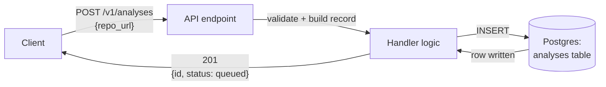

# M2: The Walking Skeleton

The thinnest slice that runs, end to end: one API endpoint → logic → database → response. Ugly is fine. It must run.

**Basic facts**

- Endpoint: `POST /v1/analyses`
- Logic: validate `repo_url`, insert one row into `analyses` with `status = queued` — no orchestrator, no agents, no RAG wired in yet
- Database: Postgres, single-table write/read (`analyses`)
- Response: `201` with `{ id, status }`
- Out of scope for this slice: auth, rate limiting, caching, LLM calls — those get added once this skeleton walks
